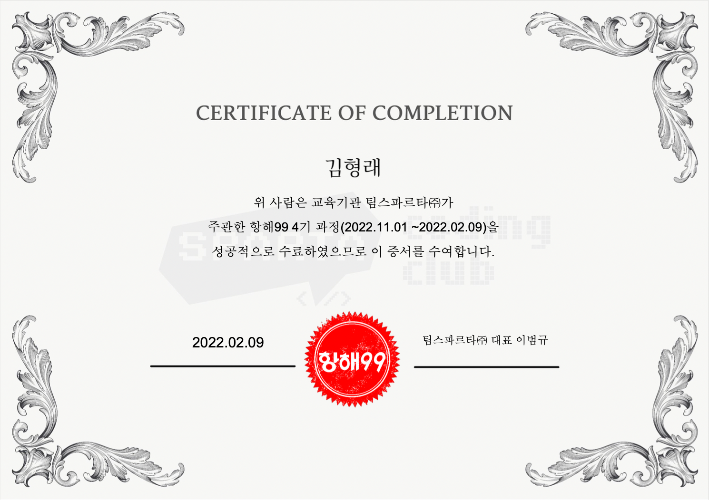

# 면접 합격 소식 / 항해 수료

오늘 내가 처음 면접봤던 회사에서 합격소식이 들려왔다..! 말을 너무 못했다고 생각해서 당연히 떨어졌을줄 알았지만.. 면접은 까보기 전까지는 모른다는게 정말인가보다.

그리고 항해 수료하는 날이기도 했다. 수료하는날에 합격소식까지 들리니 너무너무 좋았다.
본격적으로 개발자에 대한 길을 걸어갈수 있게 됐다.

나를 뽑아준 회사이니만큼 이 회사에 충성을 다해야겠다.
충성을 다하기 위해서는 열심히 공부하고 공부하여 성장하는 것이라 생각하기에 매일매일 성장하는 나로서
회사에 보여줄 것이다. 나는 이만큼의 가치가 있는 사람이라고.

사실 프로젝트가 끝나고 어떻게 공부해나가야 할지에 대한 갈피를 못잡고있었다.
근데 회사에 붙고나니 무얼 공부해야하는지 길이 보이게됐다.
내가 붙은 회사에서는 vue를 사용하기때문에 출근하는 날 전까지 뷰에 대해서 공부해가야겠다.

